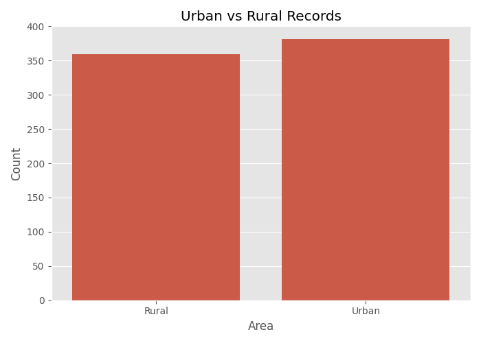
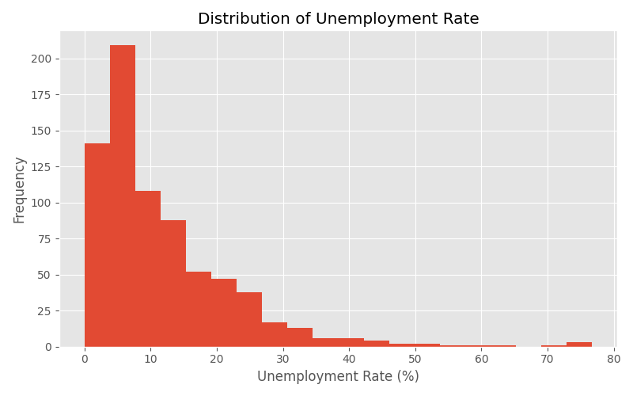
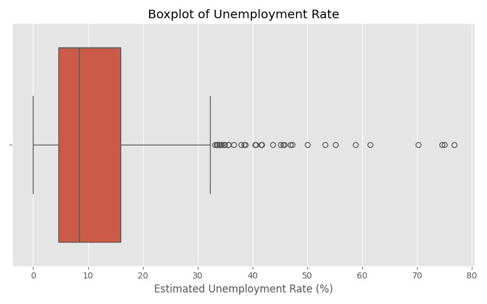
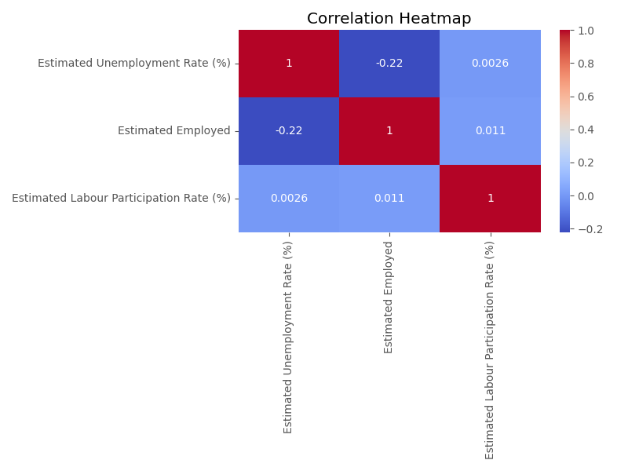
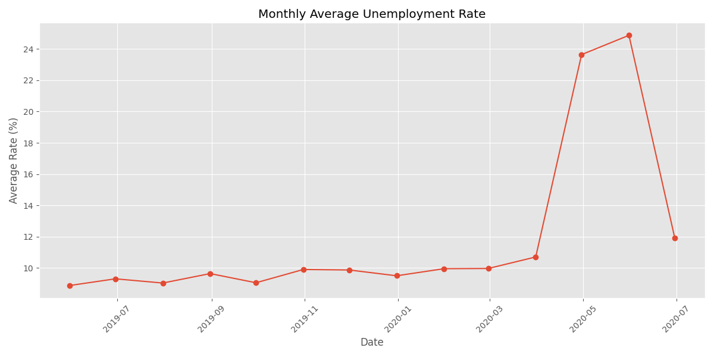

# CodeAlpha Task 2 - Unemployment Analysis with Python

## Overview

This project was completed as **Task 2** of the **CodeAlpha Data Science Internship**.

The goal of this project is to analyze unemployment data using Python by performing data cleaning, exploratory data analysis (EDA), visualization, and extracting meaningful insights.

---

## Dataset

The project uses two unemployment datasets containing information about:

- Region
- Date
- Area
- Employment
- Labour Participation Rate
- Unemployment Rate

---

## Technologies Used

- Python
- Pandas
- NumPy
- Matplotlib
- Seaborn
- Jupyter/VS Code
- OpenPyXL (for Excel datasets)

---

## Project Workflow

- Data Loading
- Data Cleaning & Preprocessing
- Missing Value Handling
- Duplicate Removal
- Date Formatting
- Exploratory Data Analysis (EDA)
- Data Visualization
- Statistical Analysis
- Insight Extraction

---

## Visualizations

### Area Distribution



---

### Top 10 Regions by Average Unemployment Rate


---

### Histogram



---

### Boxplot



---

### Correlation Heatmap



---

### Monthly Trend



---

## Key Insights

- Average unemployment rate: **11.79%**
- Highest average unemployment region: **Tripura**
- Lowest average unemployment region: **Meghalaya**
- Highest recorded unemployment rate: **76.74%**
- Lowest recorded unemployment rate: **0.00%**

---
## Future Improvements

- Interactive dashboards using Plotly
- Time-series forecasting
- Regional unemployment comparison
- Machine learning-based unemployment prediction

## Project Structure

```
CodeAlpha_Unemployment_Analysis
│
├── images
│   ├── area_distribution.png
│   ├── top10_regions.png
│   ├── histogram.png
│   ├── boxplot.png
│   ├── heatmap.png
│   └── monthly_trend.png
│
├── unemployment1.xlsx
├── unemployment2.xlsx
├── main.py
├── requirements.txt
└── README.md
```

---

## Author

**Səma Köklərova**

Computer Engineering Student

CodeAlpha Data Science Intern

GitHub:
https://github.com/iamsky2007